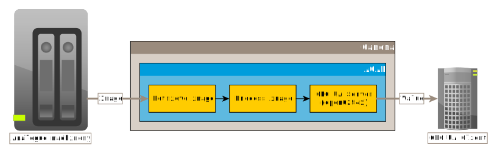
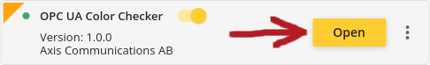
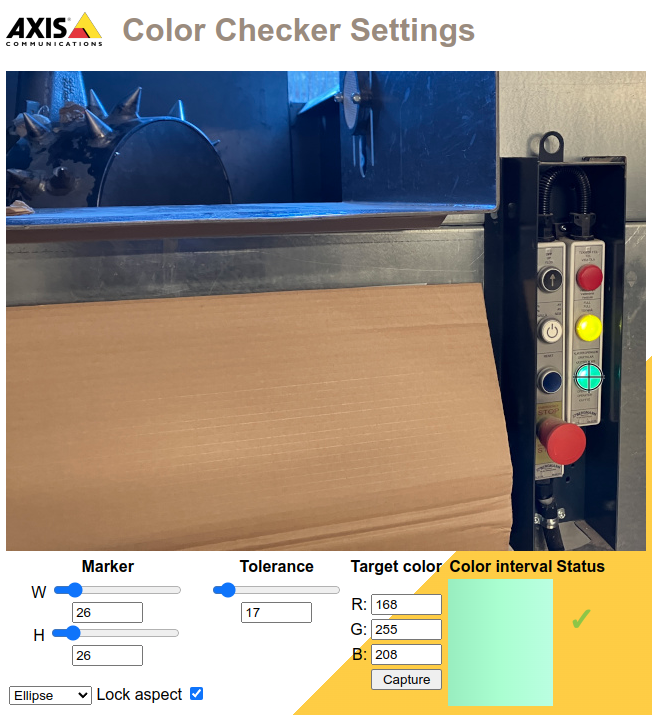
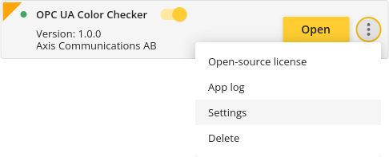
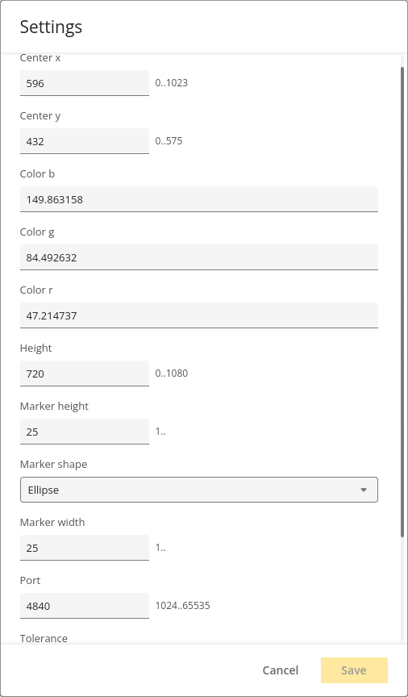

*Copyright (C) 2025, Axis Communications AB, Lund, Sweden. All Rights Reserved.*

# OPC UA Color Checker ACAP

[](https://github.com/AxisCommunications/opc-ua-colorchecker-acap/actions/workflows/build.yml)
[](https://github.com/AxisCommunications/opc-ua-colorchecker-acap/actions/workflows/super-linter.yml)

This repository contains the source code to build a small example
[ACAP version 4](https://axiscommunications.github.io/acap-documentation/)
(native) application that checks the average color of a selected part of an image,
compares it to a reference color and a certain tolerance and outputs
TRUE/FALSE through an
[OPC UA](https://en.wikipedia.org/wiki/OPC_Unified_Architecture)
([open62541](https://open62541.org/)) server to indicate if the current area
matches the reference color or not.



> [!NOTE]
> Even if this application would fit right into your usecase, its purpose is
> above all to serve as an example and boilerplate rather than being ready for
> production.

## Example Use Cases

> The following examples assume that you have a [SCADA](https://en.wikipedia.org/wiki/SCADA) (Supervisory
Control And Data Acquisition) system or a [PLC](https://en.wikipedia.org/wiki/Programmable_logic_controller) (Programmable Logic Controller) system with OPC UA as the communication protocol and you want to take advantage of the Axis device capabilities to enrich or complement your operations.

In the manufacturing and process industry, completely analog machinery is
still commonplace. This equipment is often expensive and has a long lifespan.
The machinery has control lights that are today manually monitored, and due to
warranty restrictions, any modifications or the addition of digital sensors are
prohibited. With the Color Checker application, an Axis camera can do the
digital transformation for the analog machinery where the operation status is
now instantly fed into the factory's control systems without requiring human
intervention.

In the process industry, a fluid has a certain color when operation is
normal, but a completely different color when an error occurs in the process.
An Axis camera with the Color Checker application can monitor the process
instead of a human operator, and also instantly feed the factory's control
system with information about the deviation when the color is outside the set
tolerance boundaries.

When the color is outside/inside the tolerance boundaries, the control system can then e.g.:

- shutdown or start a PLC process
- generate alarms
- trigger recording
- display real-time status within the SCADA server's operational interface
- maintain historical logs to track changes over time

> [!WARNING]
> Please note that any analytic process can never be 100% accurate and the system designer has to account for this.

## Build

The build process uses the
[ACAP SDK build container](https://hub.docker.com/r/axisecp/acap-sdk)
and Docker.

The Docker commands are integrated in the [Makefile](Makefile), so if you have
Docker and `make` on your computer all you need to do is:

```sh
make dockerbuild
```

or perhaps build in parallel:

```sh
make -j dockerbuild
```

If you do have Docker but no `make` on your system:

```sh
# 32-bit ARM, e.g. ARTPEC-6- and ARTPEC-7-based devices
DOCKER_BUILDKIT=1 docker build --build-arg ARCH=armv7hf -o type=local,dest=. .
# 64-bit ARM, e.g. ARTPEC-8 and ARTPEC-9-based devices
DOCKER_BUILDKIT=1 docker build --build-arg ARCH=aarch64 -o type=local,dest=. .
```

## Debug

If you would like the application to store the images from each step in the
video analysis to disk for debugging, set the `DEBUG_WRITE` variable for the
build:

```sh
DEBUG_WRITE=y make -j dockerbuild
```

or

```sh
# 32-bit ARM, e.g. ARTPEC-6- and ARTPEC-7-based devices
DOCKER_BUILDKIT=1 docker build --build-arg DEBUG_WRITE=y --build-arg ARCH=armv7hf -o type=local,dest=. .
# 64-bit ARM, e.g. ARTPEC-8 and ARTPEC-9-based devices
DOCKER_BUILDKIT=1 docker build --build-arg DEBUG_WRITE=y --build-arg ARCH=aarch64 -o type=local,dest=. .
```

## Setup

### Manual installation and configuration

Upload the ACAP application file (the file with the `.eap` extension for the
camera's architecture) through the camera's web UI: *Apps->Add app*

When installed, start the application.



Open the application's settings page in the web interface (available when the
application is running) by clicking the *Open* button.



In the settings page you can select the shape of the area you want to sample
(rectangle/ellipse) and the tolerance of how much deviation is allowed for the
mean value of each R/G/B channel. You can also manually enter the target color
value, or capture the current color found in the area. In order to move the
marker for the capture area, just click in the image where you would like the
center of it to be.

These values can also, along with the OPC UA Server port (default is 4840),
be set directly through the application's parameter settings, found in the
three vertical dots menu:





### Scripted installation and configuration

Use the camera's
[applications/upload.cgi](https://www.axis.com/vapix-library/subjects/t10102231/section/t10036126/display?section=t10036126-t10010609)
to upload the ACAP application file (the file with the `.eap` extension for the
camera's architecture):

```sh
curl -k --anyauth -u root:<password> \
    -F packfil=@OPC_UA_Color_Checker_<version>_<architecture>.eap \
    https://<camera hostname/ip>/axis-cgi/applications/upload.cgi
```

To
[start (or stop/restart/remove)](https://www.axis.com/vapix-library/subjects/t10102231/section/t10036126/display?section=t10036126-t10010606)
the application, you can make a call like this:

```sh
curl -k --anyauth -u root:<password> \
    'https://<camera hostname/ip>/axis-cgi/applications/control.cgi?package=opcuacolorchecker&action=start'
```

Use the camera's
[param.cgi](https://www.axis.com/vapix-library/subjects/t10175981/section/t10036014/display)
to set the center/min/max points, as well as clockwise/counterclockwise and the
OPC UA server port number.

The call

```sh
curl -k --anyauth -u root:<password> \
    'https://<camera hostname/ip>/axis-cgi/param.cgi?action=list&group=opcuacolorchecker'
```

will list the current settings:

```sh
root.Opcuacolorchecker.CenterX=320
root.Opcuacolorchecker.CenterY=379
root.Opcuacolorchecker.ColorB=142.002685
root.Opcuacolorchecker.ColorG=130.000000
root.Opcuacolorchecker.ColorR=125.118121
root.Opcuacolorchecker.Height=360
root.Opcuacolorchecker.MarkerHeight=31
root.Opcuacolorchecker.MarkerShape=0
root.Opcuacolorchecker.MarkerWidth=31
root.Opcuacolorchecker.Port=4844
root.Opcuacolorchecker.Tolerance=17
root.Opcuacolorchecker.Width=640
```

If you want to set the OPC UA server port to e.g. 4842:

```sh
curl -k --anyauth -u root:<password> \
    'https://<camera hostname/ip>/axis-cgi/param.cgi?action=update&opcuacolorchecker.port=4842'
```

## Usage

Attach an OPC UA client to the port set in ACAP. The client will then be able
to read the value (and its timestamp) from the application's OPC UA server.

> [!NOTE]
> The application will also log the color match status in the camera's syslog
> and trigger a stateful event  in the camera's event system with the current
> color match status.

### Bonus

In addition to the above, you can obtain the current status through
HTTP(S)/JSON (utilized by the web UI configuration page) by calling:

`https://<camera hostname/ip>/local/opcuacolorchecker/getstatus.cgi`

*[This CGI call requires viewer access.](manifest.json#L20)*

Similarly, and also used by the web UI configuration page, you can set the
current mean value color in the selected area to be the reference color (and
retrieve these new R/G/B values as JSON data) by calling:

`https://<camera hostname/ip>/local/opcuacolorchecker/pickcurrent.cgi`

*[This CGI call requires admin access.](manifest.json#L21)*

## License

[Apache 2.0](LICENSE)
